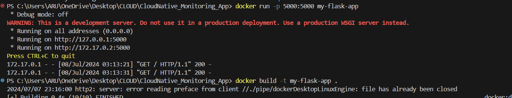
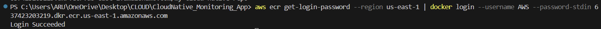
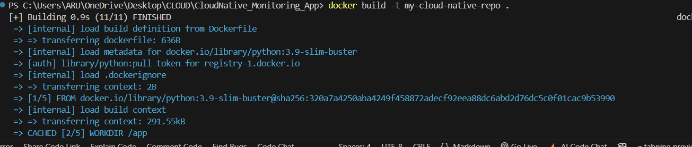
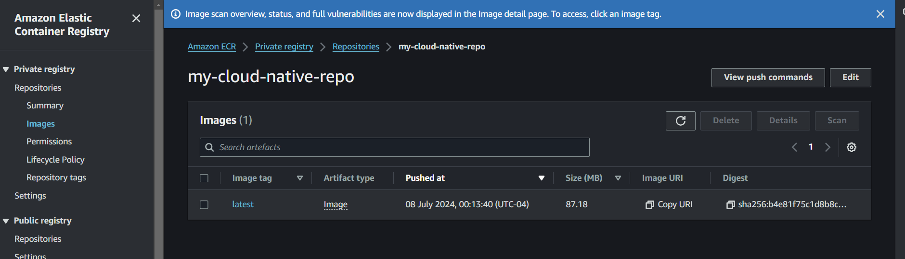
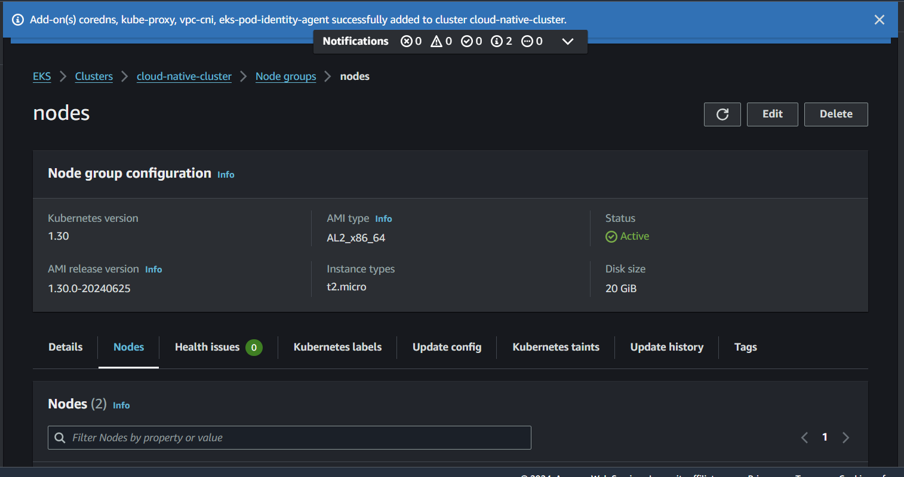
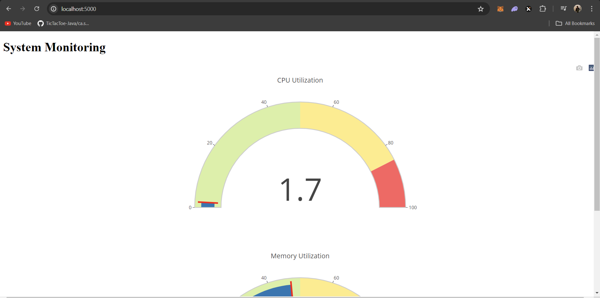

creating an app in py
containerizing it using Dockerfile --> Docker Image --> Docker container
3. Now push the docker image to AWS ECR elastic container registry using BOTO3 model in python code 
docker build -t my-flask-app .

Look at all the images
docker images

Image saved

now create container
docker run -p 5000:5000 my-flask-app

3.  python3 ecr.py
   

   aws ecr get-login-password --region us-east-1 | docker login --username AWS --password-stdin 637423203219.dkr.ecr.us-east-1.amazonaws.com
   

docker build -t my-cloud-native-repo .

Store image under this name
docker tag my-cloud-native-repo:latest 637423203219.dkr.ecr.us-east-1.amazonaws.com/my-cloud-native-repo:latest

push the image
docker push 637423203219.dkr.ecr.us-east-1.amazonaws.com/my-cloud-native-repo:latest

3 nodes

node created

