creating an app in py
containerizing it using Dockerfile --> Docker extra/image --> Docker container
3. Now push the docker extra/image to AWS ECR elastic container registry using BOTO3 model in python code 
docker build -t my-flask-app .
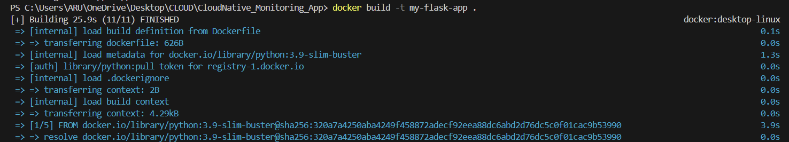
Look at all the extra/images
docker extra/images
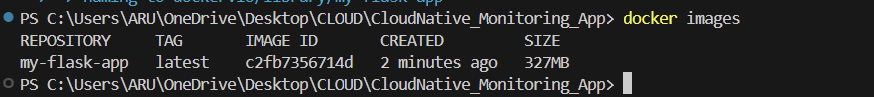
extra/image saved

now create container
docker run -p 5000:5000 my-flask-app
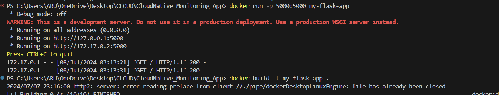
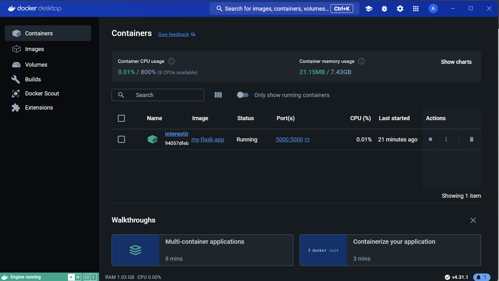
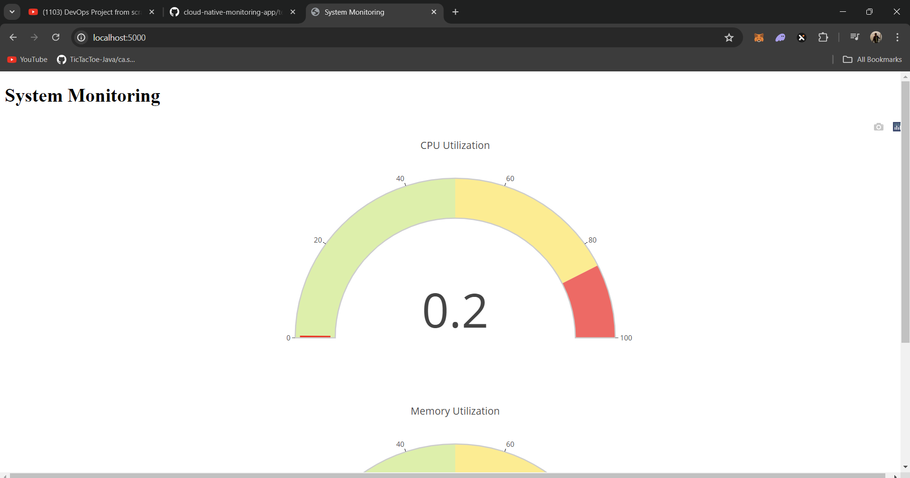

3.  python3 ecr.py
   

   aws ecr get-login-password --region us-east-1 | docker login --username AWS --password-stdin 637423203219.dkr.ecr.us-east-1.amazonaws.com
   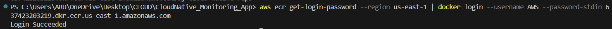

docker build -t my-cloud-native-repo .
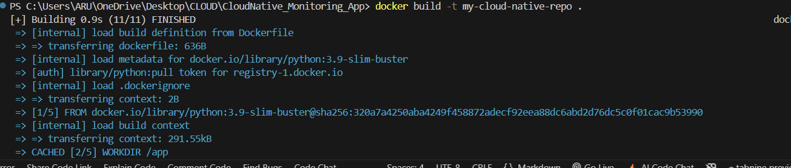
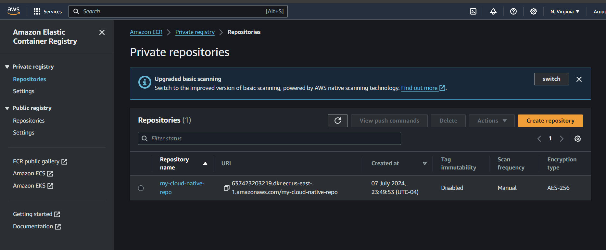
Store extra/image under this name
docker tag my-cloud-native-repo:latest 637423203219.dkr.ecr.us-east-1.amazonaws.com/my-cloud-native-repo:latest
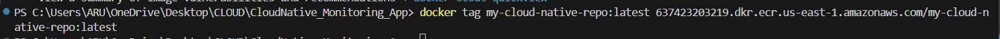

push the extra/image
docker push 637423203219.dkr.ecr.us-east-1.amazonaws.com/my-cloud-native-repo:latest
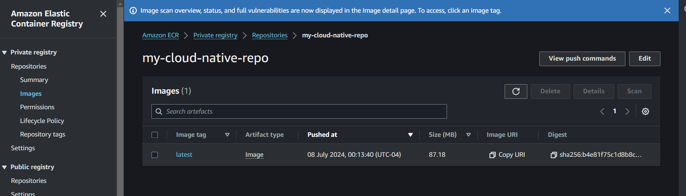

3 nodes
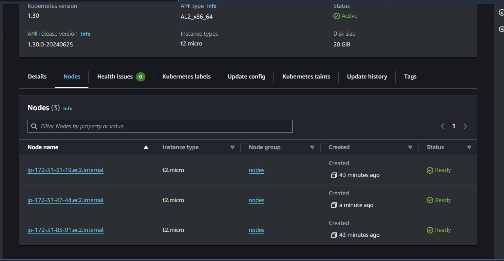

node created
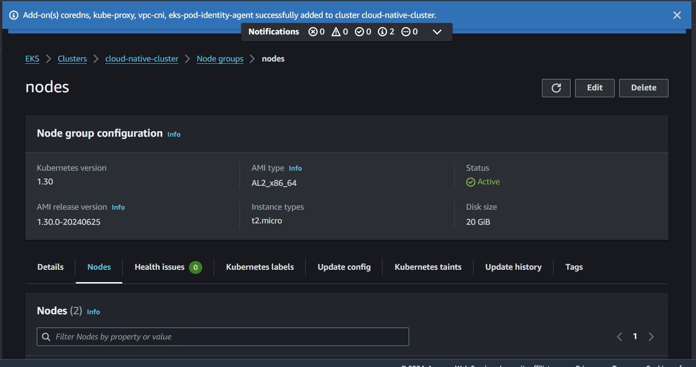

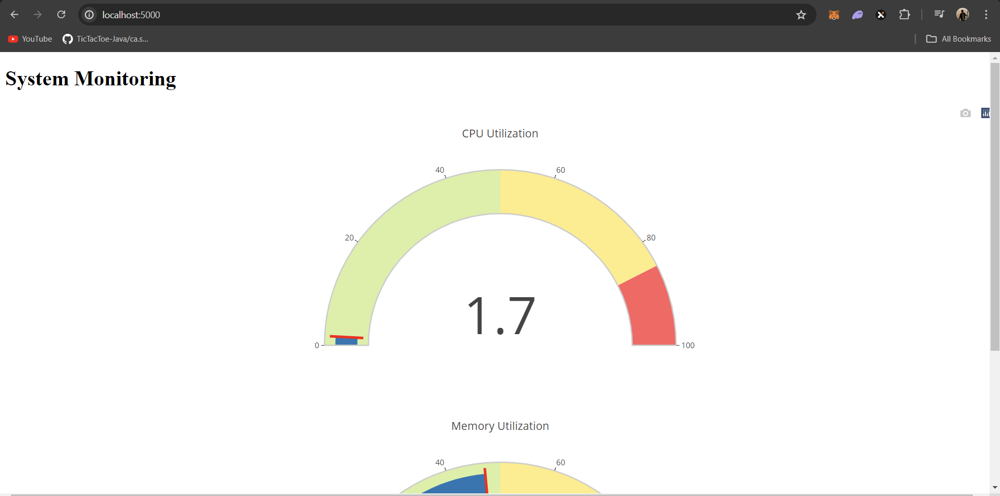
